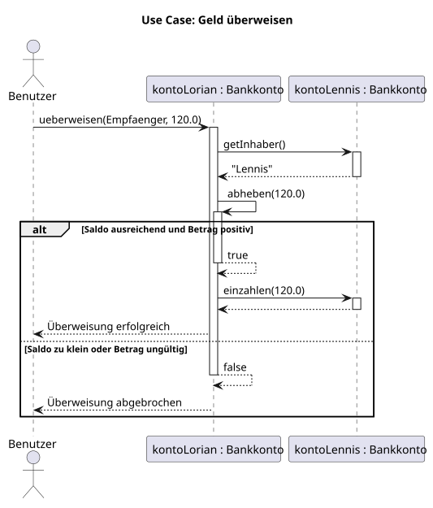
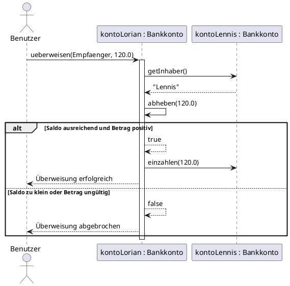

# KN-M2: Sequenzdiagramm aus D1

## Gewählter Use Case

**Lorian überweist CHF 120.– an Lennis.**

Der Ablauf stammt aus `KN-D1/src/Main.java`. Dort wird folgende Methode aufgerufen:

```java
kontoLorian.ueberweisen(kontoLennis, 120.0);
```

### Vorbedingung

- Beide Bankkonten existieren.
- Das Konto von Lorian besitzt genügend Guthaben.
- Der Überweisungsbetrag ist positiv.

### Normaler Ablauf

1. Der Benutzer startet die Überweisung beim Konto von Lorian.
2. Das Senderkonto fragt beim Empfängerkonto den Namen des Inhabers ab.
3. Das Senderkonto ruft seine eigene Methode `abheben(120.0)` auf.
4. `abheben` liefert `true` zurück.
5. Das Senderkonto delegiert die Einzahlung an das Empfängerkonto.
6. Die Überweisung wird als erfolgreich gemeldet.

### Alternativer Ablauf

Ist der Betrag ungültig oder der Saldo zu klein, liefert `abheben` den Wert
`false`. Die Einzahlung beim Empfänger wird dann nicht aufgerufen und die
Überweisung wird abgebrochen.

## Sequenzdiagramm



Der editierbare PlantUML-Code befindet sich in
[`sequenzdiagramm-ueberweisung.puml`](sequenzdiagramm-ueberweisung.puml).



## Bezug zum D1-Code

| Diagramm-Nachricht | Stelle im Code |
| --- | --- |
| `ueberweisen(Empfaenger, 120.0)` | `Main.java` ruft `kontoLorian.ueberweisen(...)` auf |
| `getInhaber()` | `Bankkonto.ueberweisen()` fragt den Namen des Empfängers ab |
| `abheben(120.0)` | Selbstaufruf innerhalb des Senderkontos |
| Rückgabe `true` oder `false` | Rückgabewert von `Bankkonto.abheben()` |
| `einzahlen(120.0)` | Delegation an das Empfängerkonto |
| `alt` / `else` | `if (abhebungErfolgreich) ... else ...` |

## Fragen zur Besprechung

- **Wie werden Aufrufe dargestellt?** Mit einem durchgezogenen Pfeil von der
  aufrufenden zur aufgerufenen Lebenslinie. Die Pfeilbeschriftung nennt die Methode
  und ihre Parameter.
- **Was sind Swimlanes?** Im Sequenzdiagramm werden sie üblicherweise
  Lebenslinien genannt. Jede senkrechte Linie gehört zu einem Akteur oder Objekt.
- **Kann man sehen, wie lange ein Objekt lebt?** Ja. Die Lebenslinie zeigt die
  Lebensdauer. Erzeugung und Zerstörung könnten zusätzlich ausdrücklich eingezeichnet
  werden. Im gewählten Use Case existieren beide Konten bereits vorher.
- **Wie wird ein Return-Value dargestellt?** Mit einem gestrichelten Pfeil zurück
  zum Aufrufer, beispielsweise `true` von `abheben`.
- **Wie werden Selbstaufrufe dargestellt?** Der Pfeil geht von der Lebenslinie
  zurück auf dieselbe Lebenslinie, wie beim Aufruf von `abheben`.
- **Wie zeigt man Alternativen?** Mit einem `alt`-Block und Bedingungen für den
  erfolgreichen beziehungsweise abgebrochenen Ablauf.

## Statische und dynamische Darstellung

Ein Klassendiagramm zeigt die **statische Struktur**, zum Beispiel Attribute,
Methoden und Beziehungen zwischen Klassen. Das Sequenzdiagramm zeigt dagegen das
**dynamische Verhalten** eines konkreten Use Cases: die zeitliche Reihenfolge der
Methodenaufrufe zwischen den beteiligten Objekten.
